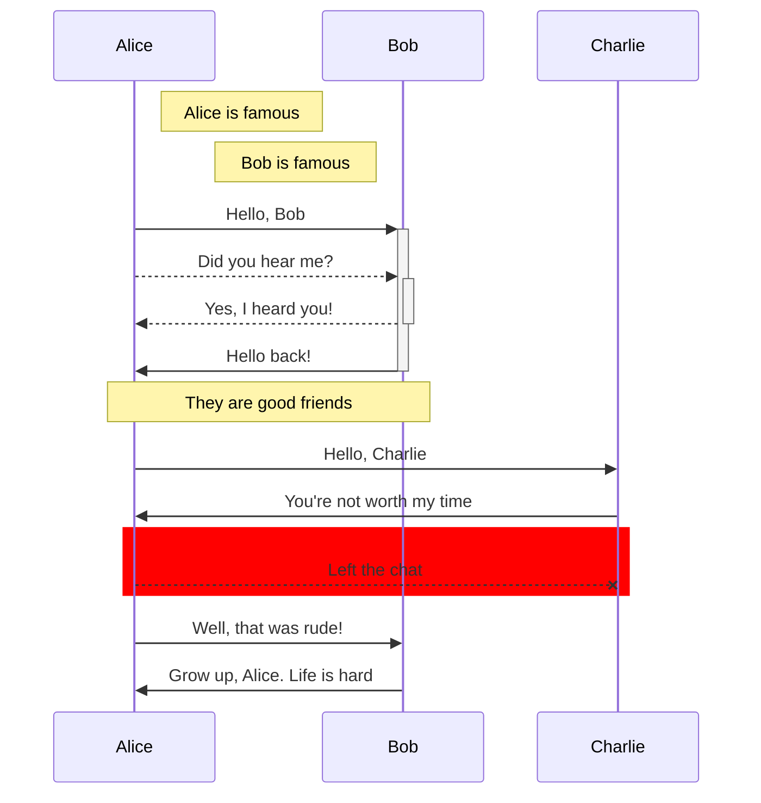

# Mermaid 
## Omschrijving
[Website](https://mermaid.js.org/)
## (Not so) Ultimate example

```mermaid
sequenceDiagram
    participant A as Alice
    participant B as Bob
    Note right of A: Alice is famous
    Note left of B: Bob is famous
    A->>+B: Hello, Bob
    A-->>+B: Did you hear me?
    B-->>-A: Yes, I heard you!
    B->>-A: Hello back!
    Note over A,B: They are good friends
    participant C as Charlie
    A->>C: Hello, Charlie
    C->>A: You're not worth my time
    rect rgb(255, 0, 0)
    A--xC: Left the chat
    end
    A->>B: Well, that was rude!
    B->>A: Grow up, Alice. Life is hard
```
